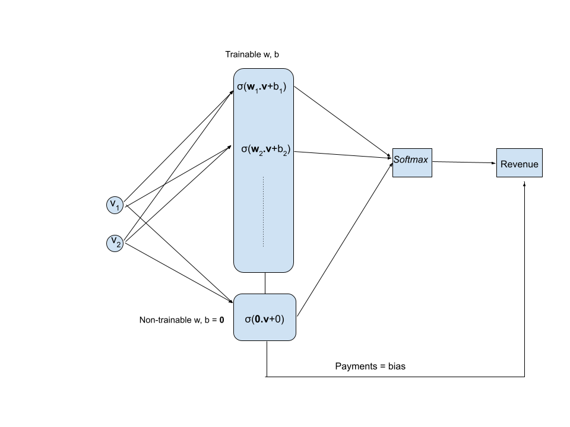
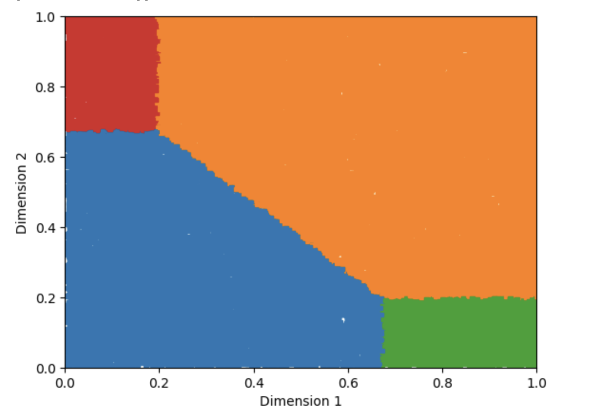

# Optimal Multi-object Pricing

This project implements revenue-maximizing mechanism for selling multiple objects to a single additive buyer.

## Requirements
* Python 3
* Tensorflow 2
* numpy and matplotlib packages

## RochetNet

This project is based on RochetNet from ["Optimal Auctions through Deep Learning"](https://arxiv.org/pdf/1706.03459.pdf).
Major differences include concise code using Tensorflow 2 and more interpretable modeling. The weights and biases are allocations and payments made to the seller, respectively.
We print the optimal menu and plot them on the type-space. Although we implement it for uniform distribution and two-object scenario, the code is easily adaptable to multi-object and any distribution.

Below is the network structure. The biases from previous layer are used in the final output. Hence the project was implemented in tensorflow static environment. Softmax is replaced by argmax during testing.

## Implementation

To implement the code, run main.py in the project folder after installing the requirements.

## Result

The project achieves high accuracy(>99.9) even for a test size of 50k types on a [0,1]^2 type-space. Below is the outcomes map on the type-space.

